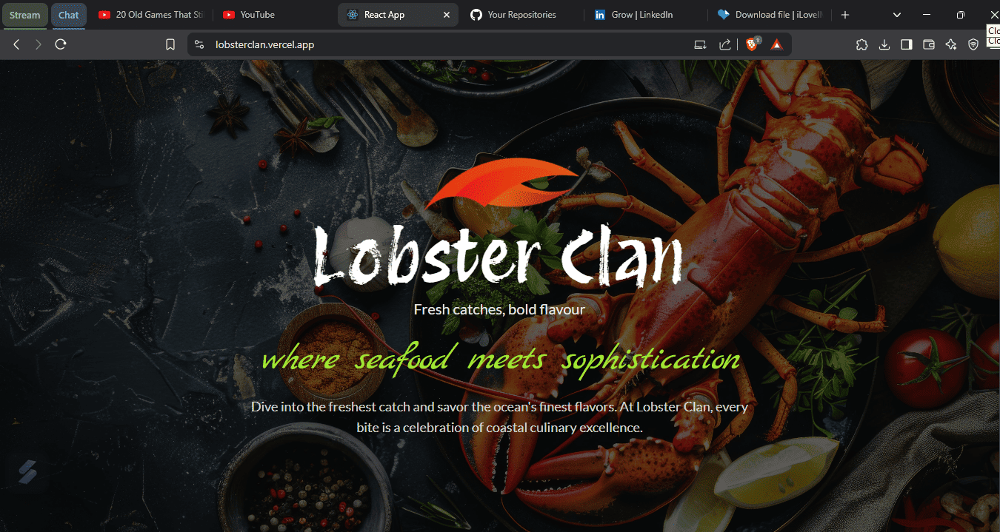
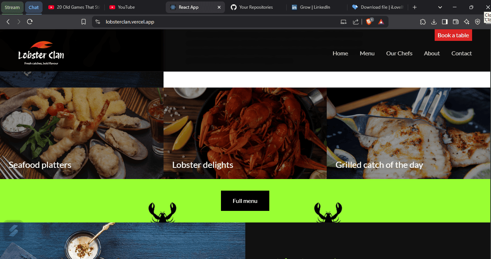
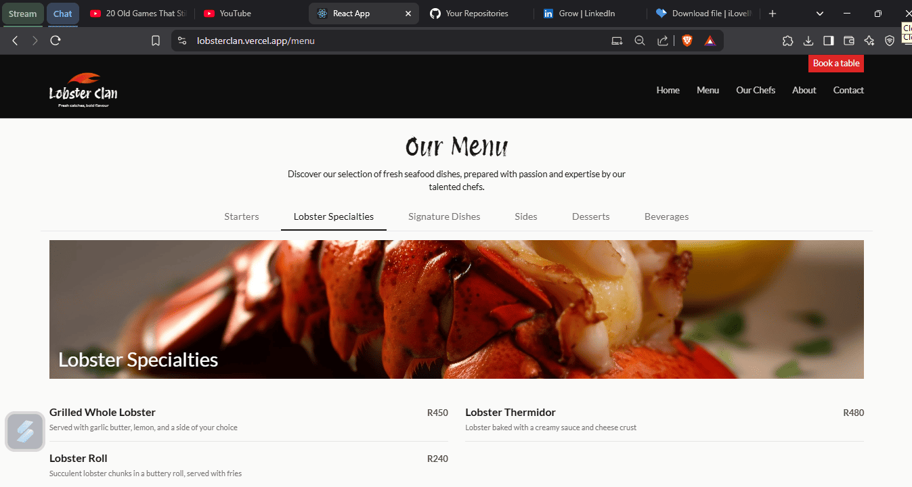
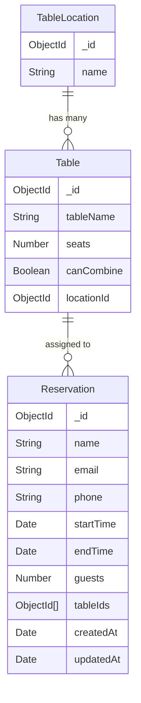

# Lobster Clan Restaurant

A modern restaurant website built with React.js and Node.js, featuring an online reservation system and menu showcase.



## Features

- Interactive menu display
- Real-time table reservation system
- Chef profiles
- Contact information
- Responsive design for all devices




## Tech Stack

- **Frontend:** React.js
- **Backend:** Node.js, Express.js
- **Database:** MongoDB
- **Routing:** React Router
- **API:** RESTful API

## Data Models



## Prerequisites

Before you begin, ensure you have the following installed:

- Node.js (v14 or higher)
- MongoDB
- npm or yarn

## Project Setup

### 1. Clone the Repository
```bash
git clone https://github.com/Tshabalala-Thabo/lobster-clan-react.git
cd lobster-clan-react
```

### 2. Install Dependencies
```bash
# Install frontend dependencies
cd frontend
npm install

# Install backend dependencies
cd ../backend
npm install
```

### 3. Environment Setup
Create a `.env` file in the `backend` directory with the following variables:
```plaintext
PORT=5000
MONGODB_URI=your_mongodb_connection_string
```

### 4. Start the Development Servers
#### Backend:
```bash
cd backend
npm start
```
#### Frontend (in a new terminal):
```bash
cd frontend
npm start
```
The application will be available at:
- **Frontend:** [http://localhost:3000](http://localhost:3000)
- **Backend:** [http://localhost:5000](http://localhost:5000)

## API Endpoints

### Reservations
- **POST** `/api/check-time-slots` - Check available time slots
- **POST** `/api/check-availability` - Check table availability
- **POST** `/api/submit-reservation` - Submit a new reservation

## Available Scripts

### Frontend
- `npm start` - Runs the app in development mode
- `npm test` - Launches the test runner
- `npm run build` - Builds the app for production
- `npm run eject` - Ejects from Create React App

### Backend
- `npm start` - Starts the server
- `npm run dev` - Starts the server with nodemon for development

## Project Structure

```plaintext
lobster-clan-react/
├── frontend/
│   ├── public/
│   └── src/
│       ├── components/
│       ├── pages/
│       └── App.js
└── backend/
    ├── controllers/
    ├── routes/
    ├── config/
    └── server.js
```

## Contributing

1. Fork the repository
2. Create your feature branch (`git checkout -b feature/AmazingFeature`)
3. Commit your changes (`git commit -m 'Add some AmazingFeature'`)
4. Push to the branch (`git push origin feature/AmazingFeature`)
5. Open a Pull Request
